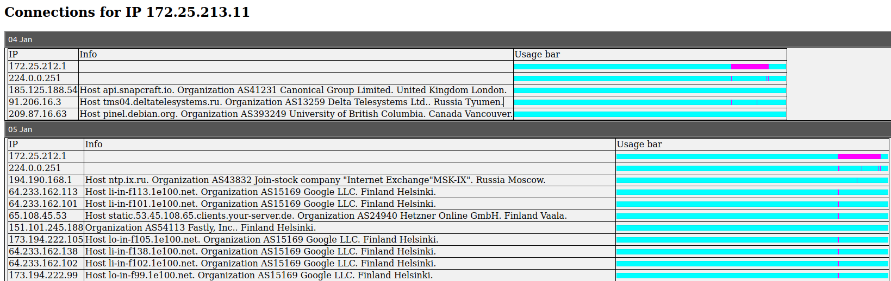

#  ulogd_sqlite3

Это инструкция по настройке nftables для логирования через ulogd2 в файл sqlite3, который затем обрабатывается
приложением ulogd_sqlite3, служащим web сервером для показа соединений в удобной форме.

## Как это всё работает

В nftables есть возможность логирования в ulogd2, про которую сказано тут: 
https://wiki.nftables.org/wiki-nftables/index.php/Logging_traffic
Преимуществом такого логгирования является то, что вместо текстовых строк можно писать события в базу данных,
а затем делать по ним поиск и выборку.

Но есть и негативная сторона. Логирование в sqlite базу данных бывает двух видов:
* Пакетное логирование (таблица ulog_pkt). Оно сохраняет только raw_pktlen, raw_pktcount, oob_prefix, oob_time_sec, 
oob_time_usec, oob_mark, oob_hook, oob_uid, oob_gid. То есть не сохраняется IP адреса источника и назначения пакета.
* Логирование соединений (таблица ulog_ct). В ней отслеживаются соединения с началом и концом, IP адресами, портами. 
Полный список flow_start_sec, flow_start_usec, flow_end_sec, flow_end_usec, orig_ip_saddr, orig_ip_daddr, orig_l4_sport,
orig_l4_dport, orig_ip_protocol, icmp_type, icmp_code, orig_raw_pktlen, orig_raw_pktcount, reply_raw_pktlen, 
reply_raw_pktcount, ct_mark.  
Логирование соединений не работает для определённых правил nftables, что логично, ведь понятие соединения выходит за 
рамки сетевого пакета, которыми управляет nftables.

Поэтому либо мы будем сохранять информацию об интересующих нас пакетах, проставлять им метки и затем по этим меткам 
их анализировать в базе данных, либо включим логирование соединений, но потеряем возможность управлять этим процессом 
из nftables. Однако мы сможем управлять фильтрацией через правила ulogd2. 

Мы пойдём путём логирования соединений, поэтому конфигурацию nftables менять никак не нужно!

# Настройка ulogd2

Установим пакет ulogd2 и расширение к нему для поддержки sqlite3. Также поставим программу для работы с базами sqlite:

`sudo apt install ulogd2 ulogd2-sqlite3 sqlite3`

Далее запустим и включим сервис ulogd2:

```bash
sudo systemctl enable ulogd2
sudo systemctl start ulogd2
```

Проверим, что сервис ulogd2 работает:

```
sudo systemctl status ulogd2
> ● ulogd2.service - Netfilter Userspace Logging Daemon
>    Loaded: loaded (/lib/systemd/system/ulogd2.service; enabled; vendor preset: enabled)
>    Active: active (running) since Mon 2022-12-12 07:57:00 MSK; 3 weeks 3 days ago
>      Docs: man:ulogd(8)
>  Main PID: 29149 (ulogd)
>    CGroup: /system.slice/ulogd2.service
>            └─29149 /usr/sbin/ulogd --daemon --uid ulog --pidfile /run/ulog/ulogd.pid
```

Видно, что сервис запущен (running) и включён (enabled).

Не сделано еще 2 вещи: нет таблицы для записи и не настроена сама запись в конфигурации ulogd2. Настроим его.
Конфигурация хранится в /etc/ulogd.conf. Отредактируем его с помощью nano:

`nano /etc/ulogd.conf`

В конфигурации есть важная часть:

```
...
plugin="/usr/lib/x86_64-linux-gnu/ulogd/ulogd_inppkt_NFLOG.so"
#plugin="/usr/lib/x86_64-linux-gnu/ulogd/ulogd_inppkt_ULOG.so"
#plugin="/usr/lib/x86_64-linux-gnu/ulogd/ulogd_inppkt_UNIXSOCK.so"
plugin="/usr/lib/x86_64-linux-gnu/ulogd/ulogd_inpflow_NFCT.so"
plugin="/usr/lib/x86_64-linux-gnu/ulogd/ulogd_filter_IFINDEX.so"
...
plugin="/usr/lib/x86_64-linux-gnu/ulogd/ulogd_output_SQLITE3.so"
...
```

Должен быть включен плагин ..._NFCT.so и ..._SQLITE3.so. По умолчанию они выключены. Далее нужно **выключить** логирование 
LOGEMU, если, конечно, мы им пользоваться не собираемся. В рамках этого мануала это логирование не используется. И нужно
**включить** логирование из NFCT в SQLITE3. Ниже показан кусок конфигурации /etc/ulogd.conf:

```
# this is a stack for logging packet send by system via LOGEMU
#stack=log1:NFLOG,base1:BASE,ifi1:IFINDEX,ip2str1:IP2STR,print1:PRINTPKT,emu1:LOGEMU
...
# this is a stack for flow-based logging to SQLITE3
stack=ct1:NFCT,sqlite3_ct:SQLITE3
```

Далее нужно настроить блок ct1, который будет источником записей для sqlite_ct в стэке. 
Важная часть настройки это имя файла для записи: `/var/log/ulog/ulogd.sqlite3db`
Также в этом примере мы требуем, чтобы только исходящие соединения из внутренней сети (192.168.100.0/24) 
за NAT логировались. Это позволяет не записывать множественные соединения между компьютерами сети. Эту опцию можно 
закомментировать.

```
[ct1]
#netlink_socket_buffer_size=217088
#netlink_socket_buffer_maxsize=1085440
#netlink_resync_timeout=60 # seconds to wait to perform resynchronization
#pollinterval=10 # use poll-based logging instead of event-driven
# If pollinterval is not set, NFCT plugin will work in event mode
# In this case, you can use the following filters on events:
accept_src_filter=192.168.100.0/24,1:2::/64 # source ip of connection must belong to these networks
#accept_dst_filter=192.168.1.0/24 # destination ip of connection must belong to these networks
#accept_proto_filter=tcp,sctp # layer 4 proto of connections

[sqlite3_ct]
table="ulog_ct"
db="/var/log/ulog/ulogd.sqlite3db"
buffer=200
```

Осталось создать базу данных с нужной таблицей. Если сейчас перезапустить сервис ulogd2, то он выйдет с ошибкой:

```
sudo systemctl restart ulogd2
sudo systemctl status ulogd2
> ...
> янв 06 11:02:29 SkyPC ulogd[167446]: table `ulog_ct' is empty or missing in file `/var/log/ulog/ulogd.sqlite3db'. Did you created this table in the database file? Please, see ulogd2 documentation.
> янв 06 11:02:29 SkyPC ulogd[167446]: SQLITE3: Could not read database fieldnames.
> янв 06 11:02:29 SkyPC ulogd[167446]: error starting `sqlite3_ct'
> янв 06 11:02:29 SkyPC ulogd[167446]: not even a single working plugin stack
```

Пример базы данных со всеми необходимыми полями есть в документации `/usr/share/doc/ulogd2/sqlite3.table`. Это дамп 
базы, поэтому нужно его подать на вход sqlite3.

`sudo cat /usr/share/doc/ulogd2/sqlite3.table | sqlite3 /var/log/ulog/ulogd.sqlite3db`

Снова делаем перезапуск сервиса и видим его активный статус:

```
sudo systemctl restart ulogd2
sudo systemctl status ulogd2
> ● ulogd2.service - Netfilter Userspace Logging Daemon
>      Loaded: loaded (/lib/systemd/system/ulogd2.service; enabled; vendor preset: enabled)
>      Active: active (running) since Fri 2023-01-06 11:27:59 MSK; 2s ago
>        Docs: man:ulogd(8)
>     Process: 171800 ExecStart=/usr/sbin/ulogd --daemon --uid ulog --pidfile /run/ulog/ulogd.pid (code=exited, status=0/SUCCESS)
>    Main PID: 171801 (ulogd)
>       Tasks: 1 (limit: 9364)
>      Memory: 648.0K
>      CGroup: /system.slice/ulogd2.service
>              └─171801 /usr/sbin/ulogd --daemon --uid ulog --pidfile /run/ulog/ulogd.pid
> 
> янв 06 11:27:59 SkyPC systemd[1]: Starting Netfilter Userspace Logging Daemon...
> янв 06 11:27:59 SkyPC systemd[1]: Started Netfilter Userspace Logging Daemon.
> янв 06 11:27:59 SkyPC ulogd[171801]: registering plugin `NFCT'
> янв 06 11:27:59 SkyPC ulogd[171801]: registering plugin `SQLITE3'
> янв 06 11:27:59 SkyPC ulogd[171801]: building new pluginstance stack: 'ct1:NFCT,sqlite3_ct:SQLITE3'
> янв 06 11:27:59 SkyPC ulogd[171801]: NFCT plugin working in event mode
> янв 06 11:27:59 SkyPC ulogd[171801]: Changing UID / GID
> янв 06 11:27:59 SkyPC ulogd[171801]: initialization finished, entering main loop
```

Можно проверить, что запись работает. Запускаем sqlite3:

`sudo sqlite3 /var/log/ulog/ulogd.sqlite3db`

Вводим запрос и должны увидеть записи вида:

```
sqlite> SELECT * from ulog_ct LIMIT 10;
1670821020|24321|1670821040|388977|30742956|30677420|38684|5801|6|||0|0|0|0|0
1670821020|24091|1670821040|644946|349510060|30677420|37481|111|6|||0|0|0|0|0
...
```

Для выхода из sqlite3 используется Ctrl+D.

### Если нет записей

Возможно в системе не используется nftables. Проверьте, что nft выводит версию 
```
nft -v
> nftables v0.7 (Scrooge McDuck)
```

# Запуск сервиса

Находясь в корне репозитория, установите нужные пакеты, скопируйте файл базы данных и запустите программу:

```bash
pip3 install -r requirements.txt
mkdir var
cp /var/log/ulog/ulogd.sqlite3db var/ulogd.sqlite3db
python3 run.py -p 8080 var/ulogd.sqlite3db
```

Сервис должен быть доступен на порту 8080 (ссылка http://localhost:8080).

## Подключение ipinfo

Для получения информации по IP можно использовать сервис ipinfo (https://ipinfo.io/account/home). 
Сервис предоставляет бесплатно до 50000 запросов информации в месяц. После регистрации сервис выдаёь токен доступа.
Запуск с токеном делается так:

`python3 run.py -p 8080 -i abcdef01234567 var/ulogd.sqlite3db`

Вместо abcdef01234567 укажите свой токен.

## Результат

